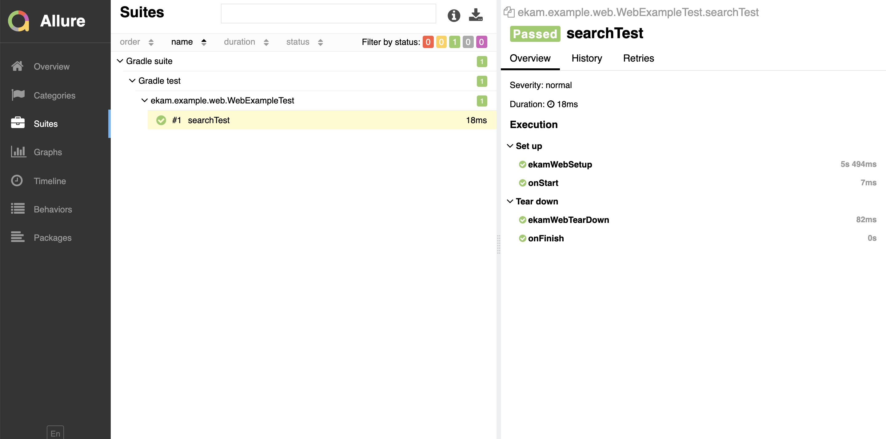

# Web Quick Start Guide

Let us do a quick google search as part of the quick guide.

## Step 1
Update the `web.url` in `config/default.properties` from `http://ekam.testvagrant.ai` to `http://www.google.com`

## Step 2
Lets create a page `SearchPage.java` in `src/test/java/web`. 

```java
public class SearchPage {
    
}
```

### Step 2.1
Ekam provides a base `WebPage` with many abstractions. Lets now extend the page to `WebPage`
```java
import com.testvagrant.ekam.web.WebPage;

public class SearchPage extends WebPage {
    
}
```

### Step 2.2
Now the page has access to many query functions to locate elements. Lets use `name=q` for google search box.
```java
import com.testvagrant.ekam.web.WebPage;

public class SearchPage extends WebPage {
    By name = queryByName("q");
    
    public void search(String query) {
        textbox(name).setText(query);
    }
}
```
Here `textbox`, `element`, `table` etc are different abstractions over web elements. We believe these are safer to use and reduce test flakiness compared to using, page factories.

## Step 3
Let's now write a test to interact with the page.

Add a new test in `src/test/web/WebExampleTest.java`.

```java
import com.testvagrant.ekam.commons.LayoutInitiator;
import com.testvagrant.ekam.testBases.testng.WebTest;

import org.testng.annotations.Test;

@Test(groups = "web")
public class WebExampleTest extends WebTest {

    @Test
    public void searchTest() {
        SearchPage searchPage = LayoutInitiator.Page(SearchPage.class);
        searchPage.search("Hello Ekam!!!");
    }
}
```

## Step 4
Let now run the test. From your terminal execute
```$bash
./gradlew clean build runWebTests
```

## Step 5
Ekam by default generates an allure report. To view the recent run execute below command
```$bash
./gradlew allureServe
```
The command once executed successfully will launch a report on your default browser.

|     |      |


