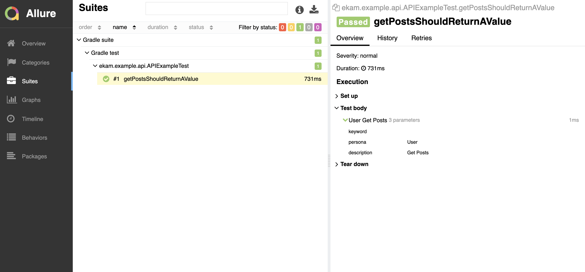

# Api Quick Start Guide

We will use https://jsonplaceholder.typicode.com to create sample API tests.

## Step 1

Create a file `hosts.json` in `src/test/resources`

```json
{
  "baseUrl": "https://jsonplaceholder.typicode.com"
}
```

## Step 2

Update the `default.properties` file with the hosts name

```bash
api.hosts:hosts
```

### Step 3

Create a model called Post to capture response

```java
import lombok.*;

@Getter
@Setter
@Builder(toBuilder = true)
@AllArgsConstructor
@NoArgsConstructor
public class Posts {
    private String userId;
    private String id;
    private String title;
    private String body;
}
```

## Step 4

Create a sample service in `src/test/java/api`

```java
import retrofit2.Call;
import retrofit2.http.GET;

import java.util.List;

public interface PostsService {
    @GET("/posts")
    Call<List<Posts>> getPosts();
}
```

## Step 5

Create a sample client to consume the service

```java
import com.google.inject.Inject;
import com.google.inject.name.Named;
import com.testvagrant.ekam.api.retrofit.RetrofitBaseClient;
import com.testvagrant.ekam.commons.annotations.APIStep;
import retrofit2.Call;

import java.util.List;

public class PostsClient extends RetrofitBaseClient {
    private final PostsService service;

    @Inject
    public PostsClient(@Named("baseUrl") String baseUrl) {
        super(baseUrl);
        service = httpClient.getService(PostsService.class);
    }

    @APIStep(description = "Get Posts")
    public List<Posts> getPosts() {
        Call<List<Posts>> call = service.getPosts();
        return httpClient.execute(call);
    }
}
```

### Step 6

Now lets write a test to interact with the client in `src/test/java/api/ApiExampleTest`

```java
import com.testvagrant.ekam.commons.LayoutInitiator;
import com.testvagrant.ekam.testBases.testng.APITest;
import org.testng.Assert;
import org.testng.annotations.Test;

import java.util.List;

@Test(groups = "api")
public class APIExampleTest extends APITest {

    public void getPostsShouldReturnAValue() {
        PostsClient postsClient = LayoutInitiator.Client(PostsClient.class);
        List<Posts> posts = postsClient.getPosts();
        Assert.assertTrue(posts.size() > 1);
    }
}
```

## Step 4

Let now run the test. From your terminal execute

```$bash
./gradlew clean build runApiTests
```

## Step 5

Ekam by default generates an allure report. To view the recent run execute below command

```$bash
./gradlew allureServe
```

The command once executed successfully will launch a report on your default browser.




Congratulations, you have successfully kick-started api automation with ekam.

Read further to understand how to get started with [Mobile](mobile.md) and [Web](web.md). 