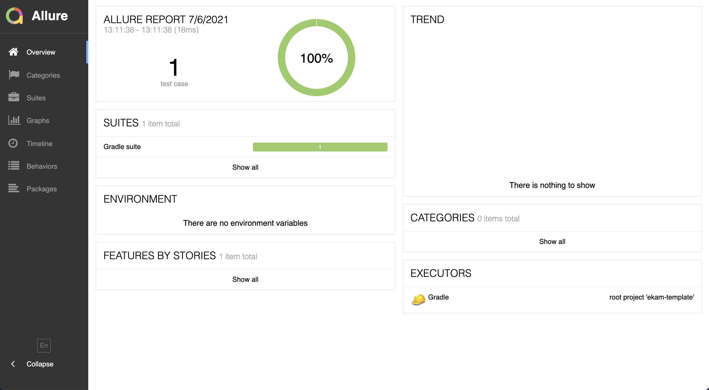
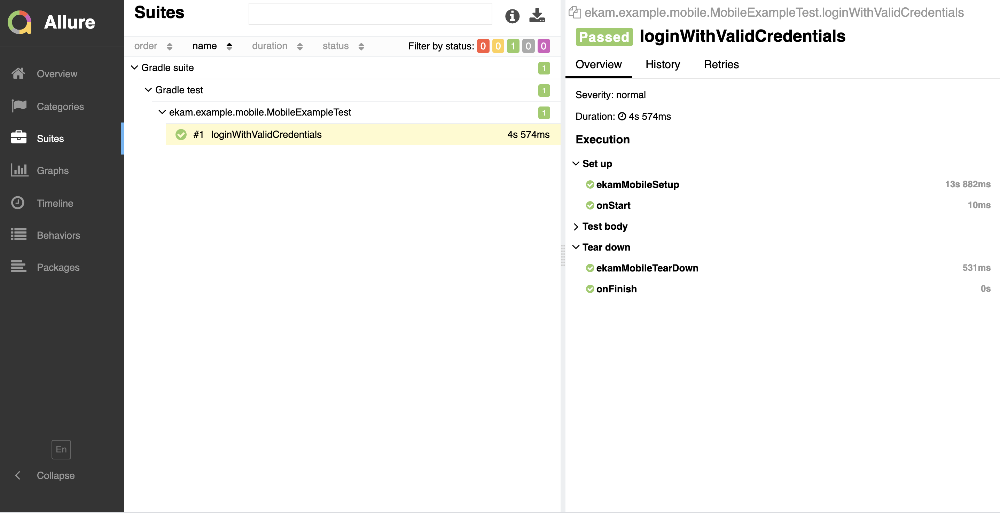
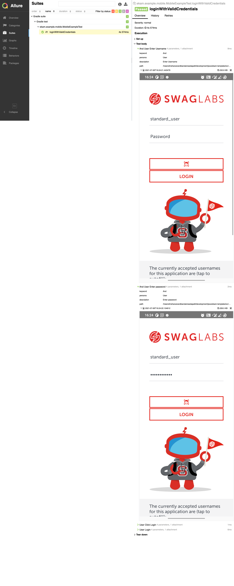

# Mobile Quick Start Guide

Let us do a quick swag mobile app login as part of this quick guide.

## Pre-requisite

* Connect a physical device or an emulator

## Step 1

Download a sample android app

```bash
cd app && wget https://github.com/testvagrant/Ekam-Template/releases/download/androidapp/sample_app.apk && cd ..
```

Download a sample iOS app

```bash
cd app && wget https://github.com/testvagrant/Ekam-Template/releases/download/iosapp/sample_app.ipa && cd ..
```

## Step 2

Lets update the `mobilefeed.json` in `src/test/resources` with below content

```json
{
  "desiredCapabilities": [
    {
      "app": "sample_app.apk",
      "platformName": "android",
      "automationName": "UiAutomator2",
      "newCommandTimeout": 300,
      "autoGrantPermissions": true,
      "appWaitActivity": "com.swaglabsmobileapp.MainActivity",
      "noReset": true,
      "avdLaunchTimeout": 300,
      "autoAcceptAlerts": true,
      "useKeystore": false,
      "browserstack.appium_version": "1.20.2"
    },
    {
      "app": "sample_app.ipa",
      "platformName": "iOS",
      "automationName": "XCUITest",
      "newCommandTimeout": 300,
      "autoGrantPermissions": true,
      "noReset": true,
      "avdLaunchTimeout": 300,
      "autoAcceptAlerts": true,
      "useKeystore": false
    }
  ]
}
```

## Step 3

Add the `mobilefeed` to `config/default.properties`

```properties
mobile.feed:mobilefeed
```

## Step 4

Lets a sample mobile screen for login

```java
import com.testvagrant.ekam.commons.annotations.MobileStep;
import com.testvagrant.ekam.mobile.MobileScreen;
import org.openqa.selenium.By;

public class LoginScreen extends MobileScreen {

    private final By usernameTextBox = queryByContentDesc("test-Username");
    private final By passwordTextBox = queryByContentDesc("test-Password");
    private final By loginButton = queryByContentDesc("test-LOGIN");
    private final By errorMessageContainer = query("//*[@content-desc = 'test-Error message']/*");
    
    public LoginScreen login(String username, String password) {
        setUsername(username);
        setPassword(password);
        clickLogin();
        return this;
    }

    
    public LoginScreen clickLogin() {
        element(loginButton).click();
        return this;
    }

   
    public LoginScreen setUsername(String username) {
        textbox(usernameTextBox).setText(username);
        return this;
    }

    
    public LoginScreen setPassword(String password) {
        textbox(passwordTextBox).setText(password);
        return this;
    }
}
```

## Step 5

Lets add a sample test in `src/test/java/mobile/MobileExampleTest.java`

```java
import com.testvagrant.ekam.commons.LayoutInitiator;
import com.testvagrant.ekam.testBases.testng.MobileTest;
import org.testng.annotations.Test;

@Test(groups = "mobile")
public class MobileExampleTest extends MobileTest {

    @Test
    public void loginWithValidCredentials() {
        LoginScreen loginScreen = LayoutInitiator.Screen(LoginScreen.class);
        loginScreen.login("standard_user", "secret_sauce");
    }
}
```

## Step 6

Let now run the test. From your terminal execute

```$bash
./gradlew clean build runMobileTests
```

## Step 7

Ekam by default generates an allure report. To view the recent run execute below command

```$bash
./gradlew allureServe
```

The command once executed successfully will launch a report on your default browser.




These are the bare minimum steps required to build and run web tests on ekam. But below are some additional steps to
dive bit deeper into ekam features.

## Run on different platforms

By default, Ekam runs mobile tests on Android. To run on different platform or set a default platform, add a
property `mobile.target` in `default.properties`

```properties
# Supported values <any | android | ios>
mobile.target:ios
```

Now the tests will start executing on iOS.

## Capture screenshot

If you look at the allure reports, there are no steps recorded or any screenshot shown. To capture step metadata add
a `@MobileStep` to screens.

```java
import com.testvagrant.ekam.commons.annotations.MobileStep;
import com.testvagrant.ekam.mobile.MobileScreen;
import org.openqa.selenium.By;

public class LoginScreen extends MobileScreen {

    private final By usernameTextBox = queryByContentDesc("test-Username");
    private final By passwordTextBox = queryByContentDesc("test-Password");
    private final By loginButton = queryByContentDesc("test-LOGIN");
    private final By errorMessageContainer = query("//*[@content-desc = 'test-Error message']/*");

    @MobileStep(description = "Login")
    public LoginScreen login(String username, String password) {
        setUsername(username);
        setPassword(password);
        clickLogin();
        return this;
    }

    @MobileStep(description = "Click Login")
    public LoginScreen clickLogin() {
        element(loginButton).click();
        return this;
    }

    @MobileStep(keyword = "And", description = "Enter Username")
    public LoginScreen setUsername(String username) {
        textbox(usernameTextBox).setText(username);
        return this;
    }

    @MobileStep(keyword = "And", description = "Enter password")
    public LoginScreen setPassword(String password) {
        textbox(passwordTextBox).setText(password);
        return this;
    }
}
```

Now let's execute the tests again and view reports

```$bash
./gradlew clean build runMobileTests && ./gradlew allureServe
```

You will find that the tests now record a step and a screenshot



Congratulations, you have successfully kick-started mobile automation with ekam.

Read further to understand how to get started with [Web](web.md) and [API](api.md). 